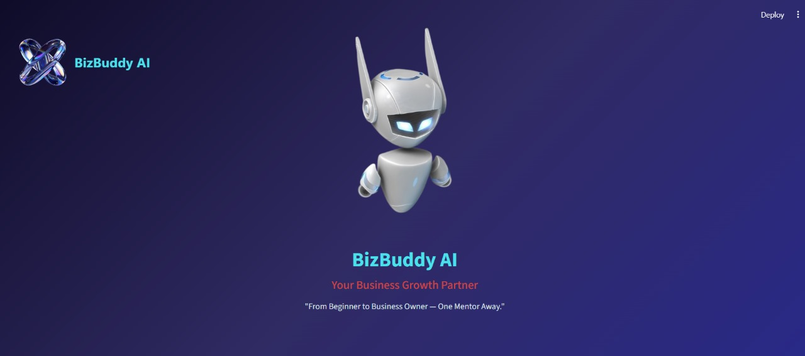
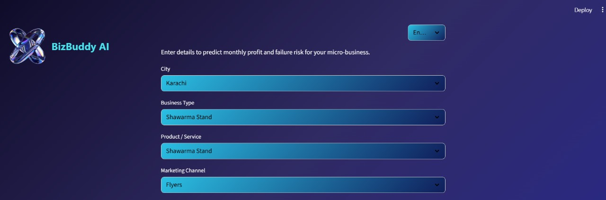
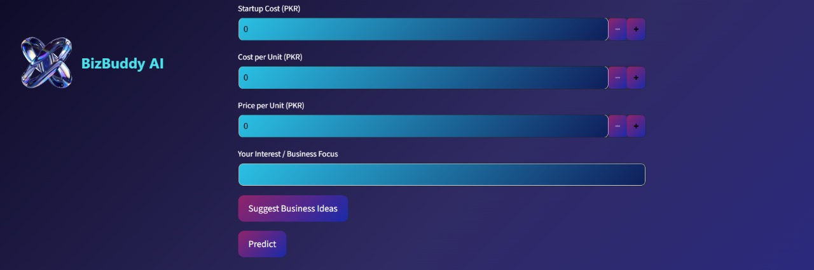
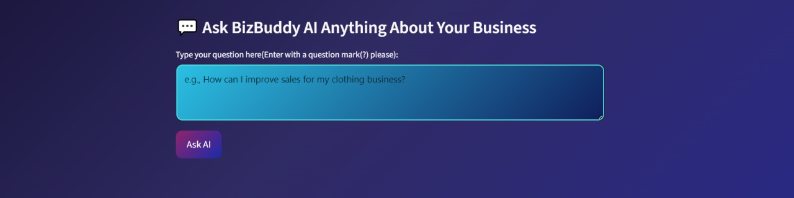

# **BizBuddy AI – Micro-Entrepreneur Coach**

BizBuddy AI is an intelligent Streamlit-based assistant that helps micro-entrepreneurs make informed business decisions.  
It predicts **profit**, **business failure risk**, and generates **AI-powered business advice** based on the user’s inputs.  
This is an MVP version created for a hackathon, with planned future integration of a full chatbot.

---

## 🚀 Features

- **Profit Prediction**  
  Uses a trained machine learning regression model to estimate projected profit.

- **Failure Risk Prediction**  
  Classifies whether a business may fail based on key features.

- **AI-Based Business Advice**  
  Provides personalized suggestions using custom rule-based and LLM-style logic.

- **Streamlit UI**  
  Clean interface with custom branding and styling.

- **Modular Code Structure**  
  Easy to maintain and expand.

---

## 🏗 Tech Stack

### **Frontend / UI**
- Streamlit  
- HTML & CSS (custom styling)

### **Backend / ML**
- Python 3.x  
- scikit-learn  
- pandas  
- joblib  

### **AI Logic**
- Prediction of profit and failure risk
- Custom advice generator  
- AI Chatbot Suggestion

---

## 📂 Project Structure

                    ai_micro_entrepreneur_coach/
                    │
                    ├── App/
                    │ ├── app.py
                    │ ├── assets/
                    │ │  ├── logo.png
                    │ │  └── robot.png
                    ├── Dataset_Generation/
                    │ ├── generate_dataset.py
                    │ ├── micro_business_dataset_500.csv
                    ├── Models_Files/
                    │ ├── encoder.pkl
                    │ ├── failure_model.pkl
                    │ ├── profit_model.pkl
                    │ ├── mistral-7b-instruct-v0.1.Q4_K_M.gguf
                    ├── utils/
                    │ │ ├── predict.py
                    │ │ └── ai_advice.py
                    │ ├── Training_Models/
                    │ │  ├── train_models.py
                    ├── setup.py
                    ├── requirements.txt
                    └── README.md

---

## ⚙️ How to Run

### 1. Clone the Repository

    git clone https://github.com/Tehreemirfan123/BizBuddy

### 2. Install Dependencies 
    pip install -r requirements.txt

### 3. Create Virtual Environment 
    python -m venv venv

### 4. Activate Virtual Environment 
    .\venv\Scripts\activate    

### 5. Run the App 
    streamlit run App/app.py

## ⚙️ App User Interface

– The begginning of App

- The Selectbox for user input 

- The prediction and suggestion portion

- Chatbot Integration for business advice.
(Kindly wait for model to run the chatting model used is large!)
